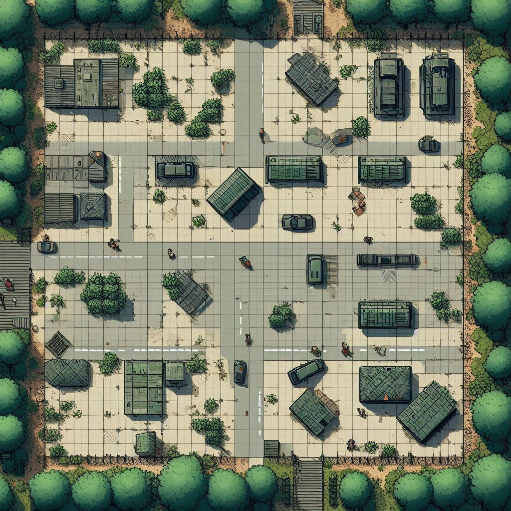
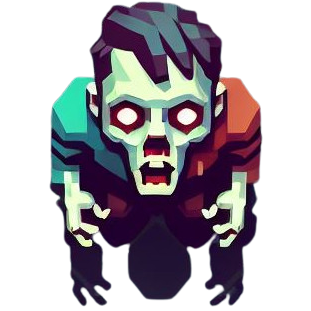

# Survival Waves
Survival Waves est un jeu ou plusieurs joueurs doivent survivre à plusieurs vagues de zombies consécutives. 

## 🎯 Contexte & cahier des charges
Dans le cadre de la ressource R5.05 Programmation avancée.

## 🎲 Règles du jeu

Dans Survival Waves, le but est de survivre le plus longtemps face aux vagues de zombies qui déferlent. Pour cela, à l'aide des objets que vous pourrez ramasser, tuez tous les zombies pour passer à la vague suivante. Plus vous gagnez, plus le jeu se corse. Une fois vous et tous vos coéquipiers morts, le jeu s'arrête.

### Map

### Zombie

## 🎮 Use cases

* **En tant que Joueur** :
    * Je peux me déplacer d'une case par tick
    * Je peux attaquer les zombies à l'aide d'une arme à feu
    * Tuer un zombie redonne instantanément des munitions
    * Je peux voir toutes les unités joueur/objets/non-joueurs de la carte
* **En tant que zombie** :
    * Je peux me déplacer aléatoirement
    * Je peux détecter un humain dans un rayon X pour lui foncer dessus
    * Je peux détecter un humain à n'importe quelle distance s'il me tire dessus
    * Je peux attaquer un humain en X coups
    * Je ne peux pas ramasser d'armes
* **En tant qu'Arbitre** :
    * Je peux lancer une nouvelle vague
    * Je peux faire réapparaître tous les joueurs à chaque nouvelle manche
    * Je peux afficher les changements de manche
    * Je peux faire apparaître des zombies
    * Je peux augmenter le nombre de zombies à chaque vague et/ou améliorer leurs stats
    * À la fin d'une manche, je peux modifier le score de la manche dans le scoreboard
    * Si tous les survivants sont morts, je mets fin à la vague en cours et note le nombre de manches passées dans le scoreboard

### Déroulé d'une partie
Un certain nombre de joueurs apparaissent sur la carte. 

Lorsque la partie commence, plusieurs zombies apparaissent en essayant de dévorer les joueurs. Si un joueur est touché plusieurs fois par un zombie,  il se transforme lui-même en zombie.

À la fin de la vague si au moins un joueur a survécu, tous les autres joueurs réapparaissent.

### Conditions de victoires
Le joueur doit survivre au maximum de vague possible.

## 📞 Diagramme de séquence
Expliquer les points suivants
- [x] les acteurs
- [x] le déroulé d'une partie en partant des use case
- [x] les données échangées entre chaque couche
- [x] les machines

## ✅ Pré-requis 
- pour l'administrateur
      Python3, pouvoir lancer l'arbitre
- pour les apprenants 
      Python3, pouvoir lancer l'agent

## 🧪 Tests
- asserts simple sur les fonctions
- utilisation de Sonarqube pour les tests de sécurité

## 🛣️ Roadmap
Kanban lié au projet

## 🧑‍💻 Auteur(s)
* ANGOT Alexandre
* CAILLY Clément
* DESMONST Arthur
* TOLLEMER Hélie

### Sources 
- DALLE 3: pour la création de chaque illustration.

